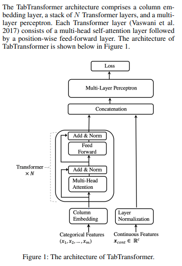
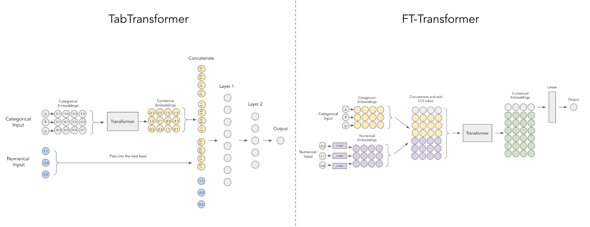

</img>

## Tab Transformer

Implementation of <a href="https://arxiv.org/abs/2012.06678">Tab Transformer</a>, attention network for tabular data, in Pytorch. This simple architecture came within a hair's breadth of GBDT's performance.

Update: Amazon AI claims to have beaten GBDT with Attention on <a href="https://arxiv.org/abs/2311.11694">a real-world tabular dataset (predicting shipping cost)</a>.

## Install

```bash
$ pip install tab-transformer-pytorch
```

## Usage

```python
import torch
import torch.nn as nn
from tab_transformer_pytorch import TabTransformer

cont_mean_std = torch.randn(10, 2)

model = TabTransformer(
    categories = (10, 5, 6, 5, 8),      # tuple containing the number of unique values within each category
    num_continuous = 10,                # number of continuous values
    dim = 32,                           # dimension, paper set at 32
    dim_out = 1,                        # binary prediction, but could be anything
    depth = 6,                          # depth, paper recommended 6
    heads = 8,                          # heads, paper recommends 8
    attn_dropout = 0.1,                 # post-attention dropout
    ff_dropout = 0.1,                   # feed forward dropout
    mlp_hidden_mults = (4, 2),          # relative multiples of each hidden dimension of the last mlp to logits
    mlp_act = nn.ReLU(),                # activation for final mlp, defaults to relu, but could be anything else (selu etc)
    continuous_mean_std = cont_mean_std # (optional) - normalize the continuous values before layer norm
)

x_categ = torch.randint(0, 5, (1, 5))     # category values, from 0 - max number of categories, in the order as passed into the constructor above
x_cont = torch.randn(1, 10)               # assume continuous values are already normalized individually

pred = model(x_categ, x_cont) # (1, 1)
```

## FT Transformer

</img>

<a href="https://arxiv.org/abs/2106.11959v2">This paper</a> from Yandex improves on Tab Transformer by using a simpler scheme for embedding the continuous numerical values as shown in the diagram above, courtesy of <a href="https://www.reddit.com/r/MachineLearning/comments/yhdqlj/project_improving_deep_learning_for_tabular_data/">this reddit post</a>.

Included in this repository just for convenient comparison to Tab Transformer

```python
import torch
from tab_transformer_pytorch import FTTransformer

model = FTTransformer(
    categories = (10, 5, 6, 5, 8),      # tuple containing the number of unique values within each category
    num_continuous = 10,                # number of continuous values
    dim = 32,                           # dimension, paper set at 32
    dim_out = 1,                        # binary prediction, but could be anything
    depth = 6,                          # depth, paper recommended 6
    heads = 8,                          # heads, paper recommends 8
    attn_dropout = 0.1,                 # post-attention dropout
    ff_dropout = 0.1                    # feed forward dropout
)

x_categ = torch.randint(0, 5, (1, 5))     # category values, from 0 - max number of categories, in the order as passed into the constructor above
x_numer = torch.randn(1, 10)              # numerical value

pred = model(x_categ, x_numer) # (1, 1)
```

## Unsupervised Training

To undergo the type of unsupervised training described in the paper, you can first convert your categories tokens to the appropriate unique ids, and then use <a href="https://github.com/lucidrains/electra-pytorch">Electra</a> on `model.transformer`.

## Todo

- [ ] consider https://arxiv.org/abs/2203.05556

## Citations

```bibtex
@misc{huang2020tabtransformer,
    title   = {TabTransformer: Tabular Data Modeling Using Contextual Embeddings},
    author  = {Xin Huang and Ashish Khetan and Milan Cvitkovic and Zohar Karnin},
    year    = {2020},
    eprint  = {2012.06678},
    archivePrefix = {arXiv},
    primaryClass = {cs.LG}
}
```

```bibtex
@article{Gorishniy2021RevisitingDL,
    title   = {Revisiting Deep Learning Models for Tabular Data},
    author  = {Yu. V. Gorishniy and Ivan Rubachev and Valentin Khrulkov and Artem Babenko},
    journal = {ArXiv},
    year    = {2021},
    volume  = {abs/2106.11959}
}
```

```bibtex
@article{Zhu2024HyperConnections,
    title   = {Hyper-Connections},
    author  = {Defa Zhu and Hongzhi Huang and Zihao Huang and Yutao Zeng and Yunyao Mao and Banggu Wu and Qiyang Min and Xun Zhou},
    journal = {ArXiv},
    year    = {2024},
    volume  = {abs/2409.19606},
    url     = {https://api.semanticscholar.org/CorpusID:272987528}
}
```
